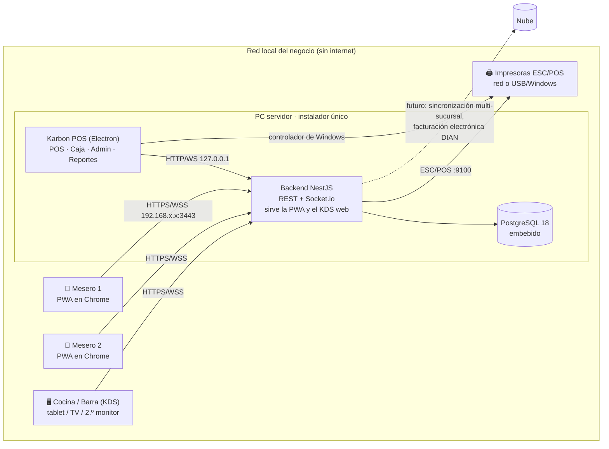
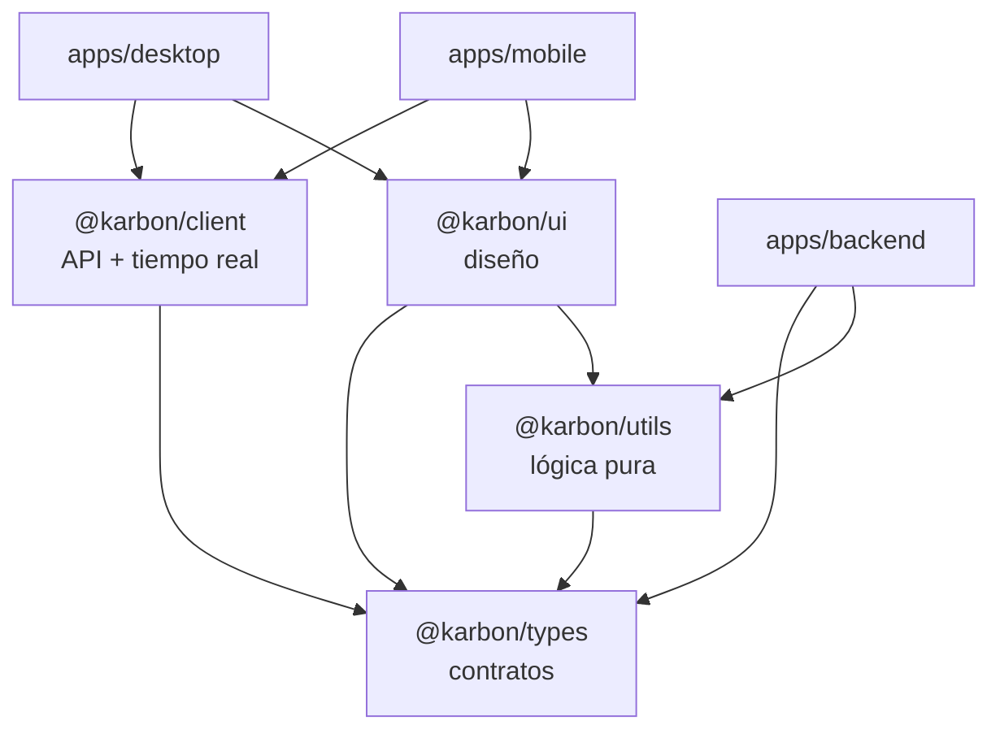
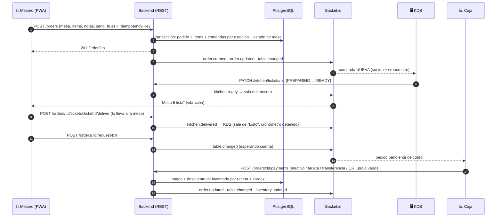

# Arquitectura de Karbon POS

Este documento describe cómo está construido Karbon POS: contexto de despliegue, componentes, capas del backend, flujo en tiempo real, seguridad, operación sin conexión y puntos de extensión. Las decisiones con alternativas están en [`docs/adr/`](adr/README.md).

## 1. Contexto: el negocio como red local

Un PC del restaurante o bar es el **servidor**: ejecuta la app de escritorio, el backend y PostgreSQL. Meseros, cocina/barra y caja se conectan por la WiFi/LAN. Internet no es necesario para operar.



| Actor          | Cliente                                                      | Rol RBAC                                 |
| -------------- | ------------------------------------------------------------ | ---------------------------------------- |
| Administrador  | Escritorio (Electron)                                        | `ADMIN`                                  |
| Cajero         | Escritorio (Electron)                                        | `CASHIER`                                |
| Mesero         | PWA en su celular                                            | `WAITER`                                 |
| Cocina / Barra | KDS: módulo del escritorio (Electron o navegador en `/app/`) | `KITCHEN` (se llama "Barra" en modo bar) |

El **modo de negocio** (restaurante o bar) es configuración, no otra aplicación: cambia adónde van las comandas y el vocabulario; todo lo demás es idéntico ([ADR 0009](adr/0009-modo-bar.md)).

## 2. Contenedores y monorepo

```
Karbon/
├── apps/
│   ├── backend/     NestJS 12 (ESM) · Prisma 7 · PostgreSQL · Socket.io · Swagger
│   ├── desktop/     Electron 44 + React 19 + Vite 8 + Tailwind 4 (POS, caja, admin, KDS)
│   │   ├── electron/    proceso principal: ventana, bandeja, impresión, supervisor del servidor
│   │   ├── src/         renderer (también se sirve por web en /app/ para el KDS)
│   │   └── scripts/     generación del ícono y armado de recursos del instalador
│   └── mobile/      PWA React 19 + Vite 8 + vite-plugin-pwa (meseros)
├── packages/
│   ├── types/       Contratos: DTOs, enums, permisos RBAC, eventos Socket.io, errores
│   ├── utils/       Dominio puro: dinero, totales de pedido, modo bar, tiempos del KDS
│   ├── client/      Cliente HTTP tipado, sesión, Socket.io, React Query, cola offline
│   └── ui/          Sistema de diseño: tokens, tema claro/oscuro, componentes, etiquetas de estado
├── docs/            Arquitectura, API, BD, despliegue, manual, ADRs y wireframes
└── .github/         CI, instalador de Windows, Dependabot y plantillas
```



**Regla de dependencias:** las apps dependen de los paquetes; los paquetes nunca dependen de apps; `types` no depende de nada. Un cambio de contrato rompe la compilación de todos los consumidores a la vez.

## 3. Backend

Cada módulo de negocio (`src/modules/<módulo>/`) separa responsabilidades por archivo:

| Archivo           | Responsabilidad                                                                                             |
| ----------------- | ----------------------------------------------------------------------------------------------------------- |
| `*.controller.ts` | HTTP: rutas, permisos (`@RequirePermissions`), Swagger. Sin lógica                                          |
| `*.dto.ts`        | Validación con `class-validator`; cada DTO **implementa** la interfaz de `@karbon/types`                    |
| `*.service.ts`    | Casos de uso: transacciones, bloqueos (`FOR UPDATE`), auditoría, eventos                                    |
| `*-rules.ts`      | Reglas puras y probadas sin base de datos (p. ej. transiciones de estado de pedidos)                        |
| `*.mapper.ts`     | Prisma → DTO (dinero a unidades menores, fechas ISO)                                                        |
| Puertos           | Interfaces con implementaciones intercambiables: `FiscalProvider` (local / DIAN), impresión ESC/POS por red |

Módulos: `auth`, `users`, `settings`, `setup`, `license`, `floor` (áreas, mesas, reservas), `catalog`, `orders` (pedidos y comandas), `cash` (caja y pagos), `billing` (tiquetes, facturas, impresión), `inventory` (insumos, kardex, compras, proveedores), `customers`, `reports`, `audit`, `realtime`. Transversales: `config` (entorno validado), `prisma`, `system` (salud, red, respaldos, TLS, mantenimiento), `common` (auth, errores, paginación, idempotencia, dinero), `database` (migrador y seed).

### Verificación de contratos en compilación

`src/common/contracts.check.ts` compara cada enum de Prisma con su equivalente en `@karbon/types`. Si una migración agrega un valor y el contrato no, `npm run typecheck` falla.

## 4. Flujo operativo en tiempo real



- **REST para mutaciones** (validadas, auditables, idempotentes); **Socket.io solo notifica**. Un cliente que pierde eventos se resincroniza con un GET.
- Cada evento viaja en un sobre `{ id, occurredAt, data }` para descartar duplicados tras reconectar.
- Celulares (sobre todo iOS, que suspende la app en segundo plano): al volver tras más de 10 s, al recuperar la red o al restaurar la página, `bindResumeSync` reconecta el socket y recarga el estado por REST sin esperar a que venza el ping.
- **Salas** según los permisos del usuario autenticado (`kitchen`, `cashier`, `waiters`, `admin`, `user:<id>`); los clientes no eligen sala.
- **Concurrencia**: `orders.version` (bloqueo optimista) + `SELECT … FOR UPDATE` en las transacciones de pedidos, pagos y caja. Dos terminales editando el mismo pedido: la segunda recibe `409 ORDER_VERSION_CONFLICT` y recarga.

## 5. Modelo de dominio (resumen)

- **Pedido** (`orders`): `OPEN → BILL_REQUESTED → PAID` (o `CANCELLED`); tipos mesa, para llevar y domicilio.
- **Comandas** (`kitchen_tickets`): cada envío crea una por estación (cocina / barra; en modo bar todo va a barra); el KDS las mueve `NEW → PREPARING → READY` y el mesero del pedido confirma `READY → DELIVERED` ([ADR 0007](adr/0007-comandas-y-cuenta-dividida.md), [ADR 0012](adr/0012-entrega-confirmada-por-el-mesero.md)). Los cronómetros se calculan con las marcas de cada paso (`ticketTiming` en `@karbon/utils`): lo entregado muestra un total fijo.
- **Propiedad del pedido**: cada mesero opera sus pedidos; `orders:manage_any` opera los de todos (`canManageOrder`, misma regla en backend y pantallas).
- **Llamados internos** (`staff_calls`): cocina, barra y caja llaman al mesero; el mesero llama a caja. Se guardan en la base y el socket solo avisa; repetir uno abierto insiste en él ([ADR 0013](adr/0013-llamados-internos-persistidos.md)).
- **Mesa**: estado persistido (`FREE`, `OCCUPIED`, `WAITING_FOOD`, `WAITING_BILL`, `PAID`, `RESERVED`); se pueden unir y mover pedidos entre mesas.
- **Inventario por receta**: cada venta descuenta `receta × cantidad` de cada insumo con un movimiento inmutable en el kardex; anular un pago lo repone. Costo promedio ponderado al recibir compras.
- **Caja**: una sola sesión abierta (índice parcial único); esperado = base + efectivo cobrado + ingresos − retiros − gastos en efectivo; el cierre registra el arqueo y la diferencia.
- **Facturación**: tiquete POS con numeración autorizada (`numbering_ranges`), desglose de impuestos y anulación auditada.

Detalle completo en [DATABASE.md](DATABASE.md).

## 6. Escritorio y servidor embebido

El proceso principal de Electron (`apps/desktop/electron/`) cumple dos papeles:

1. **Cliente**: ventana con el renderer servido por el protocolo propio `app://karbon`, impresión (HTML → impresora de Windows o PDF con `printToPDF`), bandeja del sistema e inicio con Windows.
2. **Servidor** (instalación real o `--embedded`): `ServerSupervisor` inicia PostgreSQL con `pg_ctl`, lanza el backend como proceso hijo supervisado, espera `/health` y publica el estado en la bandeja. Cerrar la ventana no apaga el servidor ([ADR 0011](adr/0011-servidor-embebido-supervisado.md)).

El renderer no sabe si corre en Electron o en un navegador: `window.karbon` (preload con `contextBridge`) solo existe en Electron y cada función tiene una alternativa web (p. ej. imprimir con un `iframe`).

## 7. Seguridad

| Capa                 | Medida                                                                                                                                                                                                     |
| -------------------- | ---------------------------------------------------------------------------------------------------------------------------------------------------------------------------------------------------------- |
| Transporte           | HTTPS con CA local restringida por Name Constraints (solo nombres e IPs privadas); HTTP como respaldo LAN ([ADR 0003](adr/0003-https-ca-local-y-respaldo-http.md)); PostgreSQL solo escucha en `127.0.0.1` |
| HTTP                 | Helmet, CORS limitado a red privada y `app://karbon` (nunca `null`), rate limiting global (600/min) y estricto en credenciales (10/min), límite de tamaño de cuerpo                                        |
| Autenticación        | JWT de acceso corto (15 min) + refresh token rotativo con detección de reutilización (se revoca la familia y queda en auditoría); PIN para terminales compartidas                                          |
| Autorización         | RBAC por permisos `recurso:acción`; roles de sistema sincronizados desde el código; roles personalizados; permisos finos para descuentos, anulaciones y arqueo                                             |
| Validación           | `ValidationPipe` global con `whitelist` + `forbidNonWhitelisted`; variables de entorno validadas al arrancar                                                                                               |
| Datos                | Contraseñas y PIN con bcrypt; invariantes como `CHECK` en PostgreSQL; bitácora de auditoría consultable (Configuración → Auditoría); secretos del servidor generados al azar por instalación               |
| Escritorio           | `contextIsolation`, `sandbox`, sin `nodeIntegration`, CSP, protocolo `app://` con protección contra path traversal, navegación externa bloqueada, permisos del navegador denegados por defecto             |
| Licencia             | Clave firmada Ed25519 validada sin conexión; la clave privada nunca está en el repositorio ni en el cliente ([ADR 0010](adr/0010-licencias-firmadas-sin-conexion.md))                                      |
| Cadena de suministro | `npm audit` con `overrides`, Dependabot semanal, lockfile versionado                                                                                                                                       |

## 8. Offline y resiliencia

- **Sin internet**: todo funciona en la LAN. No se cargan fuentes, scripts ni recursos externos.
- **Celular sin WiFi un momento**: con HTTPS, el Service Worker sirve la app; el catálogo, las mesas y la configuración quedan en caché persistente, así la PWA abre incluso sin conexión. Los pedidos se encolan en IndexedDB con su `Idempotency-Key` y se reenvían solos al volver la red (también en modo HTTP).
- **Servidor reiniciándose** (`502/503/504`): los clientes lo tratan como falta de red, no como error, y reintentan.
- **Caída del backend**: el supervisor lo reinicia; los clientes se reconectan y resincronizan con GET.
- **Corte de luz**: PostgreSQL se recupera con su WAL; respaldos diarios, al cerrar caja y manuales.

## 9. Puntos de extensión comerciales

| Capacidad                    | Estado                                                                                                                                                           |
| ---------------------------- | ---------------------------------------------------------------------------------------------------------------------------------------------------------------- |
| Impresión térmica            | ✅ ESC/POS por red (puerto 9100) desde el backend; USB y cualquier impresora de Windows desde el escritorio                                                      |
| Tiquete / factura A4 / PDF   | ✅ Una plantilla HTML (térmica de 80 mm o A4) → impresora de Windows o PDF; ESC/POS para térmicas de red                                                         |
| Facturación electrónica DIAN | Puerto `FiscalProvider` listo (`ElectronicInvoiceProvider` responde `FISCAL_PROVIDER_NOT_CONFIGURED`); `invoices.fiscal_code` (CUFE) y resoluciones en el modelo |
| Licenciamiento               | ✅ Prueba de 30 días + licencias firmadas; activación en línea opcional a futuro                                                                                 |
| Respaldos                    | ✅ Programados, al cerrar caja y manuales; restauración desde el escritorio                                                                                      |
| Multi-sucursal y nube        | `branch_id` + UUID v7 + `updated_at`/`deleted_at`; outbox de sincronización en una fase posterior ([ADR 0006](adr/0006-uuid-v7-y-multisucursal.md))              |
| Domicilios                   | `orders.type = DELIVERY` ya existe; repartidores y estados en una fase posterior                                                                                 |
| QR en la mesa                | `tables.qr_token` (UUID v4 no predecible) para menú público y "llamar al mesero"                                                                                 |
