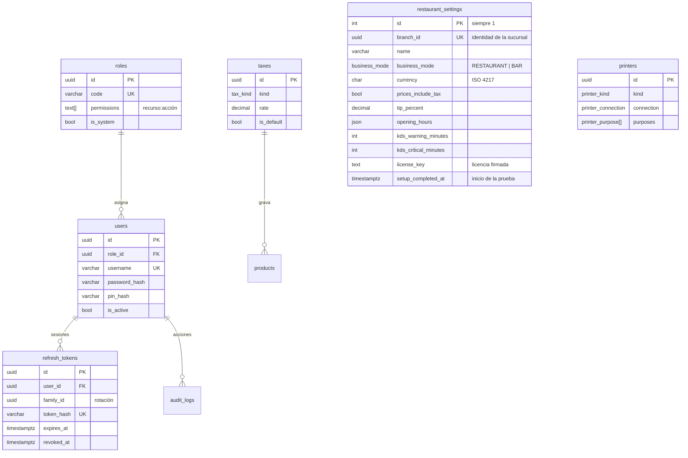
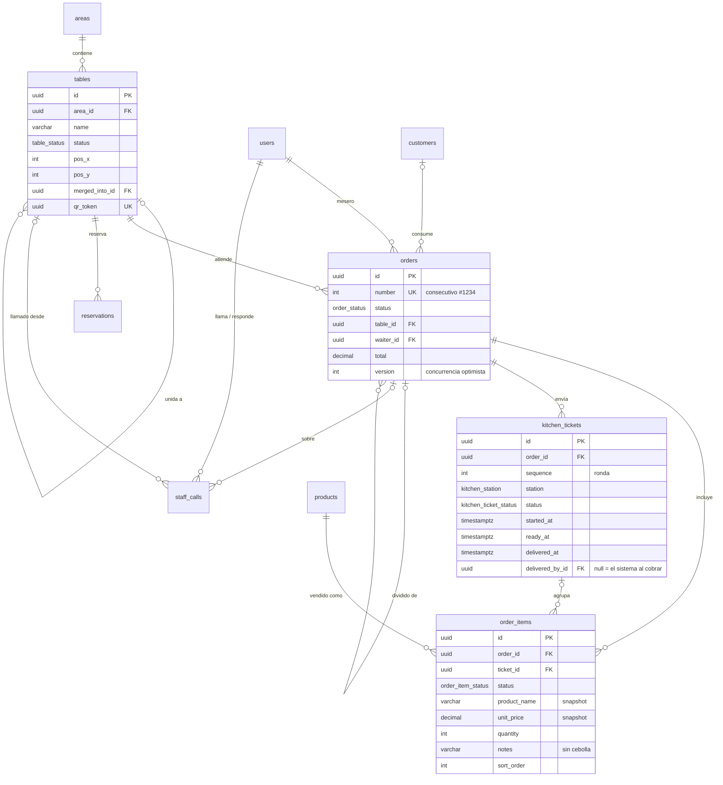
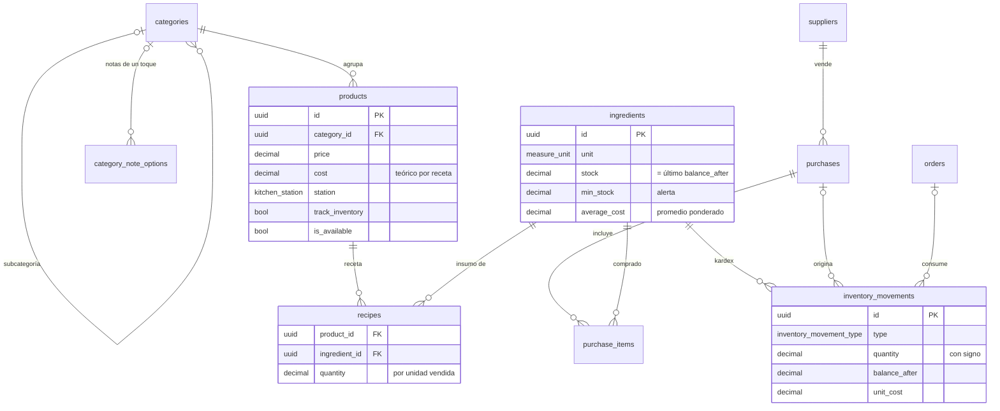
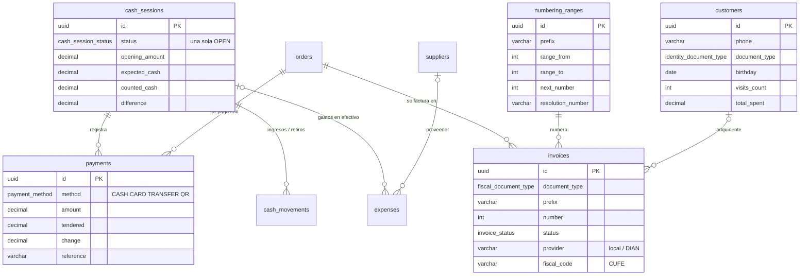

# Base de datos

PostgreSQL 18 con Prisma 7. Fuente de verdad del esquema: [`apps/backend/prisma/schema.prisma`](../apps/backend/prisma/schema.prisma). Migraciones versionadas en [`apps/backend/prisma/migrations/`](../apps/backend/prisma/migrations/).

## Convenciones

| Tema            | Convención                                                                                                                              |
| --------------- | --------------------------------------------------------------------------------------------------------------------------------------- |
| Nombres         | Tablas y columnas en `snake_case` (plural para tablas); modelos Prisma en `PascalCase` con `@@map`/`@map`                               |
| Identificadores | UUID v7 generados por la aplicación (ordenables por tiempo; permiten crear IDs offline). Consecutivos legibles aparte (`orders.number`) |
| Dinero          | `DECIMAL(14,2)`. La API lo expone como entero en unidades menores ([ADR 0005](adr/0005-dinero-en-unidades-menores.md))                  |
| Cantidades      | `DECIMAL(14,3)` en la unidad de medida del insumo; costos unitarios `DECIMAL(14,4)`; tarifas `DECIMAL(5,2)` (8.00 = 8 %)                |
| Fechas          | `TIMESTAMPTZ(3)` en UTC; `DATE` para cumpleaños y vigencias                                                                             |
| Auditoría       | `created_at` y `updated_at` en todas las tablas mutables; `deleted_at` (borrado lógico) en datos maestros                               |
| Snapshots       | Las líneas de pedido congelan nombre, precio y tarifa del producto al vender                                                            |
| Invariantes     | `CHECK` constraints en SQL dentro de la migración (Prisma no los modela) y un índice parcial único para la caja abierta                 |
| Enums           | Tipos `ENUM` nativos de PostgreSQL, idénticos a `@karbon/types` (verificado en compilación)                                             |

## Diagramas entidad-relación

### Acceso y configuración



### Salón, pedidos y cocina



### Catálogo e inventario



### Caja, pagos, clientes y facturación



## Tablas

| Dominio       | Tabla                   | Propósito                                                                                 |
| ------------- | ----------------------- | ----------------------------------------------------------------------------------------- |
| Acceso        | `roles`                 | Roles RBAC con lista de permisos; los de sistema se sincronizan desde el código           |
|               | `users`                 | Usuarios con contraseña y PIN opcional (hash bcrypt)                                      |
|               | `refresh_tokens`        | Sesiones por dispositivo con rotación y detección de reutilización                        |
|               | `audit_logs`            | Bitácora de acciones sensibles (Configuración → Auditoría, `GET /audit-logs`)             |
| Configuración | `restaurant_settings`   | Fila única: negocio, modo restaurante/bar, moneda, propina, horarios, KDS, licencia       |
|               | `taxes`                 | Tarifas (Impoconsumo 8 %, IVA 19 %, exento)                                               |
|               | `printers`              | Impresoras térmicas/estándar por USB, red o sistema y su propósito                        |
| Salón         | `areas`                 | Zonas del mapa (Salón, Terraza, Barra)                                                    |
|               | `tables`                | Mesas con posición en el mapa, estado, unión de mesas y token QR                          |
|               | `floor_elements`        | Barra, cocina, baños, entrada, caja y paredes del plano, en la misma grilla que las mesas |
|               | `reservations`          | Reservas por mesa y hora                                                                  |
| Catálogo      | `categories`            | Categorías jerárquicas con color para el POS                                              |
|               | `category_note_options` | Notas de un toque por categoría (o generales, sin categoría), con orden y activación      |
|               | `products`              | Productos con precio, costo teórico, estación y disponibilidad                            |
| Inventario    | `ingredients`           | Insumos con stock, mínimo y costo promedio                                                |
|               | `recipes`               | Líneas de receta producto ↔ insumo                                                        |
|               | `inventory_movements`   | Kardex inmutable: compras, entradas, salidas, mermas, ventas, reversos y ajustes          |
|               | `suppliers`             | Proveedores                                                                               |
|               | `purchases`             | Compras (borrador → recibida)                                                             |
|               | `purchase_items`        | Líneas de compra                                                                          |
| Clientes      | `customers`             | Clientes con historial agregado (visitas, consumo, última visita)                         |
| Pedidos       | `orders`                | Pedidos con totales, versión y trazabilidad de cancelación/división                       |
|               | `order_items`           | Líneas con snapshot, notas, orden y anulación                                             |
|               | `kitchen_tickets`       | Comandas por ronda y estación para el KDS                                                 |
|               | `staff_calls`           | Llamados internos (al mesero o a caja): quién llamó, quién fue y cuándo se cerró          |
| Caja          | `cash_sessions`         | Turnos de caja con arqueo                                                                 |
|               | `payments`              | Pagos por método (varios por pedido = mixto o cuenta dividida)                            |
|               | `cash_movements`        | Ingresos y retiros de efectivo no asociados a ventas                                      |
|               | `expenses`              | Gastos del negocio (desde caja o no)                                                      |
| Facturación   | `numbering_ranges`      | Rangos de numeración / resoluciones                                                       |
|               | `invoices`              | Documentos emitidos, agnósticos del proveedor fiscal                                      |
| Sistema       | `idempotency_keys`      | Respuestas guardadas por `Idempotency-Key` (cola offline); se limpian a los 2 días        |
|               | `_prisma_migrations`    | Migraciones aplicadas (Prisma o el migrador del instalador, mismo formato)                |

## Índices relevantes

| Consulta frecuente                 | Índice                                                                             |
| ---------------------------------- | ---------------------------------------------------------------------------------- |
| Tablero KDS por estación y estado  | `kitchen_tickets (station, status, created_at)`                                    |
| Pedido activo de una mesa          | `orders (table_id, status)`                                                        |
| Ventas por mesero / por hora       | `orders (waiter_id, created_at)`, `orders (created_at)`                            |
| Producto más vendido               | `order_items (product_id, created_at)`                                             |
| Kardex de un insumo                | `inventory_movements (ingredient_id, created_at)`                                  |
| Arqueo por método de pago          | `payments (cash_session_id, method)`                                               |
| Una sola caja abierta (invariante) | `UNIQUE (status) WHERE status = 'OPEN'` en `cash_sessions`                         |
| Búsqueda rápida de clientes        | `customers (phone)`, `customers (name)`                                            |
| Llamados abiertos por destino      | `staff_calls (status, target)`                                                     |
| Un llamado abierto por motivo      | `UNIQUE (dedupe_key) WHERE status IN ('PENDING', 'ACKNOWLEDGED')` en `staff_calls` |

## Invariantes garantizados por la base de datos

Además de claves foráneas y únicas, la migración inicial agrega `CHECK` constraints; entre ellos:

- `restaurant_settings.id = 1` (fila única) y umbrales KDS coherentes (`warning < critical`).
- Montos no negativos en productos, pedidos, facturas y caja; pagos, gastos y movimientos de caja estrictamente positivos.
- `order_items`: cantidad > 0 y descuento ≤ precio × cantidad.
- `payments`: en efectivo, lo entregado ≥ monto.
- `cash_sessions`: `CLOSED` ⇔ `closed_at` presente.
- `tables`: una mesa no puede unirse a sí misma.
- `kitchen_tickets`: solo una comanda `DELIVERED` registra `delivered_by_id`.
- `staff_calls`: cada destino con sus motivos; solo el llamado al mesero apunta a una persona; abierto ⇔ sin `closed_at`; `ACKNOWLEDGED` con `acknowledged_at`; `call_count ≥ 1`.
- `category_note_options`: texto no vacío y único por categoría sin distinguir mayúsculas (índice único sobre `COALESCE(category_id, …)` y `lower(label)`, así las generales también quedan cubiertas).

### Migraciones de datos

Los roles de sistema se crean con el seed, que solo corre en instalaciones nuevas. Cuando una versión agrega permisos, su migración los suma a los roles existentes sin quitar los que ya tenían (p. ej. `20260928202352_waiter_delivery`: `orders:deliver` para todo rol que toma pedidos, `orders:manage_any` para administración y caja, y ambos para la barra si el negocio está en modo bar; `20260928230000_waiter_table_operations`: `tables:operate` para el rol Mesero y `orders:manage_any` para todo rol que cobra, que hasta entonces operaba pedidos de cualquiera). `20260928235000_category_note_options` convierte las notas rápidas que antes estaban fijas en el código en notas generales, según el modo del negocio, para que los meseros no noten el cambio hasta que el administrador las organice por categoría. `20260929144446_staff_calls` da `calls:waiter` a todo rol que prepara o cobra y `calls:cashier` a todo rol que toma pedidos sin cobrar (y ambos al administrador).

## Flujo de trabajo con migraciones

```bash
npm run db:up        # PostgreSQL 18 en Docker (puerto 55432)
npm run db:migrate   # prisma migrate dev: crea y aplica una migración a partir de schema.prisma
npm run db:deploy    # prisma migrate deploy: aplica migraciones pendientes (CI, producción)
npm run db:seed      # seed idempotente
npm run db:reset     # borra la BD de desarrollo, reaplica migraciones y seed
npm run db:studio    # Prisma Studio
```

1. Editar `schema.prisma`.
2. `npm run db:migrate -- --name descripcion_del_cambio` (usar `--create-only` si se necesita agregar SQL a mano, p. ej. un `CHECK`).
3. Si cambió un enum, actualizar `@karbon/types` (la compilación lo exige).
4. Incluir la carpeta de migración en el mismo commit que el cambio de esquema.

En el instalador no hay CLI de Prisma: el backend aplica las mismas carpetas al arrancar con su migrador propio, que registra cada una en `_prisma_migrations` con el mismo checksum ([ADR 0011](adr/0011-servidor-embebido-supervisado.md)).

La CI aplica todas las migraciones sobre un PostgreSQL 18 limpio, verifica que `schema.prisma` no tenga cambios sin migración (`prisma migrate diff --exit-code`) y ejecuta el seed dos veces para comprobar su idempotencia.

## Seed

`src/database/seed/seed.ts` (compilado a `dist/` para producción):

- **Instalador**: no ejecuta el seed de desarrollo. El asistente de primera instalación (`POST /setup`) reutiliza los mismos pasos: roles, configuración, impuestos, numeración, el administrador que elige el cliente y, si lo pide, los datos demo.
- **Siempre**: roles de sistema (permisos desde `DEFAULT_ROLE_PERMISSIONS`), administrador inicial (`SEED_ADMIN_USERNAME`/`SEED_ADMIN_PASSWORD`; obligatoria y robusta en producción), configuración, impuestos colombianos, numeración de tiquetes y las notas generales del modo (si aún no hay ninguna nota).
- **Demo** (`SEED_DEMO_DATA=true`, solo con catálogo vacío): personal de ejemplo con PIN, 15 mesas en 3 áreas, 5 categorías con sus notas de un toque, 11 productos con receta y costo calculado, 18 insumos con inventario inicial registrado en el kardex (uno bajo el mínimo para ver la alerta), un proveedor y un cliente.
