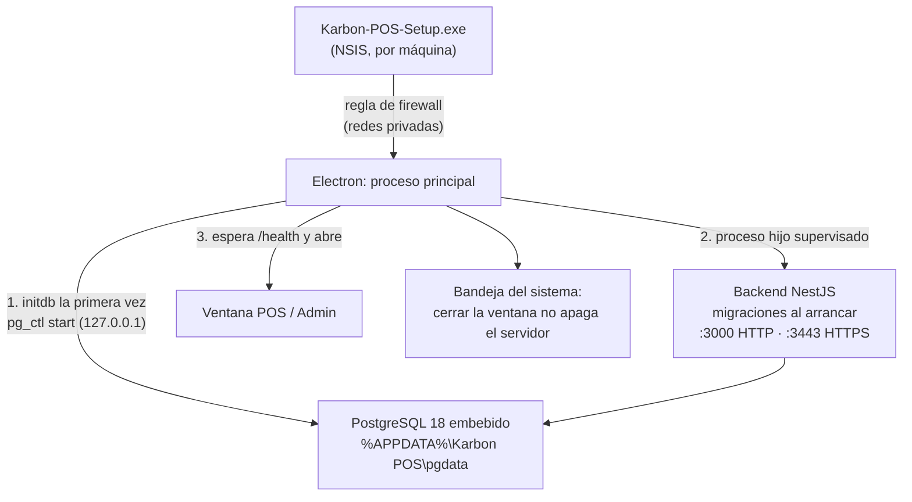

# Despliegue y entornos

## Resumen

| Entorno                  | Cómo corre                                                                                                                     |
| ------------------------ | ------------------------------------------------------------------------------------------------------------------------------ |
| Desarrollo               | Node 24 + `npm run dev`; PostgreSQL en Docker                                                                                  |
| Servidor embebido (dev)  | `npm run dev:embedded -w @karbon/desktop`: Electron levanta PostgreSQL y el backend compilados, igual que el instalador        |
| Demo / integración       | `docker compose up` (PostgreSQL + backend)                                                                                     |
| CI                       | GitHub Actions: calidad, migraciones sobre PostgreSQL 18, pruebas de integración, build, imagen Docker, instalador Windows     |
| Producción (restaurante) | Instalador único de Windows: Electron + backend + PostgreSQL 18 embebido ([ADR 0002](adr/0002-despliegue-instalador-unico.md)) |

## Desarrollo local

Requisitos: **Node 24 LTS** (ver `.nvmrc`), npm 10+, Docker Desktop.

```bash
npm install                                   # instala el monorepo y genera el cliente Prisma
cp apps/backend/.env.example apps/backend/.env
npm run db:up                                 # PostgreSQL 18 en localhost:55432
npm run db:deploy                             # aplica migraciones
npm run db:seed                               # datos base + demo
npm run dev                                   # backend :3000, escritorio (Electron) y PWA :5174
```

| Comando               | Qué levanta                                                                             |
| --------------------- | --------------------------------------------------------------------------------------- |
| `npm run dev:backend` | API en `http://localhost:3000` (Swagger en `/api/docs`) con recarga en caliente         |
| `npm run electron`    | Renderer Vite en `:5173` + proceso principal (tsdown en watch) + ventana de Electron    |
| `npm run mobile`      | PWA en `http://localhost:5174` y en `http://<IP-LAN>:5174` para probar desde un celular |

> El PostgreSQL de Docker se publica en el puerto **55432** para no chocar con instalaciones nativas de PostgreSQL (que suelen ocupar 5432/5433). Se puede cambiar con `POSTGRES_PORT` en un `.env` de la raíz.

### Probar desde un celular en desarrollo

1. PC y celular en la misma WiFi. Permitir Node.js en el firewall de Windows (redes privadas).
2. `npm run dev:backend` y `npm run mobile`.
3. En el celular: `http://<IP-del-PC>:5174`. Sin la CA instalada la app corre en **modo HTTP de respaldo**: funciona, pero sin Service Worker ([ADR 0003](adr/0003-https-ca-local-y-respaldo-http.md)).

### Servidor embebido en desarrollo

```bash
npm run build                                  # compila todo el monorepo
npm run dev:embedded --workspace=@karbon/desktop
```

Arma `apps/desktop/staging/` (ver abajo) y abre Electron con `--embedded`: crea su propio clúster de PostgreSQL, aplica las migraciones, arranca el backend y muestra el asistente de primera instalación. Los datos de desarrollo quedan en `%APPDATA%\Karbon POS (desarrollo)`, separados de una instalación real en el mismo equipo.

## Docker Compose (demo / integración)

```bash
docker compose up --build        # PostgreSQL + backend
```

- Imagen multi-etapa (Node 24 Alpine, usuario sin privilegios, solo dependencias de producción, healthcheck en `/api/v1/health`).
- Al arrancar ejecuta `prisma migrate deploy` y el seed idempotente; con `SEED_DEMO_DATA=true` (por defecto) carga el restaurante demo.
- Variables (en un `.env` de la raíz): `POSTGRES_USER`, `POSTGRES_PASSWORD`, `POSTGRES_DB`, `POSTGRES_PORT`, `BACKEND_PORT`, `JWT_SECRET`, `SEED_ADMIN_USERNAME`, `SEED_ADMIN_PASSWORD`, `SEED_DEMO_DATA`, `CORS_ORIGINS`, `SWAGGER_ENABLED`, `LOG_LEVEL`.
- Los valores por defecto de `JWT_SECRET` y de la clave del administrador (`KarbonDemo2026!`) son solo para este entorno.

## Variables de entorno del backend

| Variable                               | Por defecto        | Descripción                                                                                                                                         |
| -------------------------------------- | ------------------ | --------------------------------------------------------------------------------------------------------------------------------------------------- |
| `NODE_ENV`                             | `development`      | `development` · `production` · `test`                                                                                                               |
| `HOST` / `PORT`                        | `0.0.0.0` / `3000` | Interfaz y puerto HTTP (todas las interfaces: los celulares llegan por la LAN)                                                                      |
| `HTTPS_PORT`                           | `0`                | Puerto HTTPS con la CA local (0 = deshabilitado). El instalador usa `3443`                                                                          |
| `DEV_MOBILE_PORT` / `DEV_DESKTOP_PORT` | `0`                | Solo desarrollo: puertos de Vite (5174 / 5173) para que Configuración → Celulares muestre el QR de la app de meseros y del KDS con la IP del equipo |
| `LOG_LEVEL`                            | `log`              | `error` · `warn` · `log` · `debug` · `verbose`                                                                                                      |
| `DATABASE_URL`                         | —                  | Obligatoria. URL de PostgreSQL                                                                                                                      |
| `JWT_SECRET`                           | —                  | Obligatoria. Mínimo 32 caracteres (el instalador genera una aleatoria por equipo)                                                                   |
| `JWT_ACCESS_TTL_SECONDS`               | `900`              | Vida del token de acceso                                                                                                                            |
| `JWT_REFRESH_TTL_DAYS`                 | `30`               | Vida del refresh token (rotativo)                                                                                                                   |
| `CORS_ORIGINS`                         | vacío              | Orígenes extra permitidos (la red privada y `app://karbon` siempre se permiten)                                                                     |
| `SWAGGER_ENABLED`                      | `true`             | Publica `/api/docs` (el instalador lo desactiva)                                                                                                    |
| `DATA_DIR`                             | `./data`           | Imágenes, logo, certificados (`tls/`) y respaldos (`backups/`)                                                                                      |
| `MIGRATIONS_DIR`                       | vacío              | Si se define, el backend aplica las migraciones al arrancar (instalador)                                                                            |
| `CLIENT_MOBILE_DIR`                    | vacío              | Build de la PWA de meseros a servir en `/`                                                                                                          |
| `CLIENT_DESKTOP_DIR`                   | vacío              | Build del renderer de escritorio a servir en `/app/` (KDS en tablets y TVs)                                                                         |
| `PG_BIN_DIR`                           | vacío (PATH)       | Carpeta de `pg_dump` y `pg_restore` para los respaldos                                                                                              |
| `SEED_ADMIN_USERNAME`                  | `admin`            | Solo seed de desarrollo / Docker                                                                                                                    |
| `SEED_ADMIN_PASSWORD`                  | `Admin123*` (dev)  | Solo seed; en producción no hay claves por defecto: el administrador se crea en el asistente                                                        |
| `SEED_DEMO_DATA`                       | `true` en dev      | Carga el restaurante demo si el catálogo está vacío                                                                                                 |

Una configuración inválida detiene el arranque con un mensaje que lista cada problema.

## CI/CD (GitHub Actions)

| Workflow      | Disparador                                      | Trabajos                                                                                                                                                                                                               |
| ------------- | ----------------------------------------------- | ---------------------------------------------------------------------------------------------------------------------------------------------------------------------------------------------------------------------- |
| `ci.yml`      | push a `main`/`develop`, pull requests          | **quality**: Prettier, ESLint, typecheck, pruebas unitarias y e2e · **database**: migraciones sobre PostgreSQL 18 limpio, detección de esquema sin migración, seed ×2, pruebas de integración · **build** · **docker** |
| `desktop.yml` | tags `v*`, PR que tocan apps o paquetes, manual | Compila todo, instala PostgreSQL 18 (para `pg_dump`/`pg_restore`), arma `staging/` y genera el instalador NSIS como artefacto descargable                                                                              |
| Dependabot    | semanal / mensual                               | npm agrupado por ecosistema, GitHub Actions y la imagen base de Docker                                                                                                                                                 |

Recomendado: proteger `main` exigiendo los checks `quality`, `database` y `build`, y revisión de al menos una persona.

## Producción: instalador único

### Generar el instalador

```bash
npm install                    # incluye los binarios de PostgreSQL embebido (dependencia opcional por plataforma)
npm run desktop:release        # compila todo, arma staging/ y genera release/Karbon-POS-Setup-<versión>.exe
```

`npm run desktop:package` hace lo mismo sin instalador (carpeta `release/win-unpacked`, útil para probar).

`apps/desktop/scripts/stage-resources.ts` arma `apps/desktop/staging/`, que electron-builder copia como `extraResources`:

| Carpeta           | Contenido                                                                                                           |
| ----------------- | ------------------------------------------------------------------------------------------------------------------- |
| `server/`         | Backend compilado, migraciones SQL y dependencias de producción (sin la CLI de Prisma: el backend migra solo)       |
| `clients/`        | Build de la PWA de meseros y del renderer (KDS web)                                                                 |
| `postgres/`       | PostgreSQL 18 embebido (`initdb`, `pg_ctl`, `postgres`) con el runtime de Visual C++ junto a los binarios           |
| `postgres-tools/` | `pg_dump` y `pg_restore` con las DLL que importan (se toman de `PG_TOOLS_DIR`, por defecto PostgreSQL 18 instalado) |

En CI, si falta `pg_dump` el armado falla: un instalador sin respaldos no se publica.

### Qué pasa en el equipo del restaurante



- **Datos** en `%APPDATA%\Karbon POS\`: `pgdata/` (base de datos), `data/` (imágenes, `tls/`, `backups/`), `logs/` (`server.log`, `postgres.log`) y `server.json` (puertos y secretos generados al azar, solo lectura para el usuario). Desinstalar o actualizar no los borra.
- **Puertos**: PostgreSQL escucha solo en `127.0.0.1` (54329 o el siguiente libre); el backend en 3000 (HTTP) y 3443 (HTTPS), o los siguientes libres.
- **Supervisión**: si el backend se cae se reinicia solo (hasta 5 veces por minuto); si Electron muere, el backend se apaga en ~1 s (vigila el PID del padre). "Salir" en la bandeja detiene backend y PostgreSQL de forma ordenada.
- **Inicio con Windows**: opción en la bandeja y en Configuración → Sistema; arranca oculto (`--hidden`) para que el servidor esté listo antes de abrir la caja.

### Primer arranque

1. Asistente: nombre del negocio, modo **Restaurante** o **Bar**, moneda y administrador (no hay claves por defecto). Opcional: datos demo.
2. El backend crea la **CA local** (ECDSA P-256, 10 años, Name Constraints: `localhost`, `.local`, `.lan`, `.home.arpa` e IPs privadas) y un certificado de servidor de 397 días para las IPs LAN del equipo; se renueva solo 30 días antes de vencer o si cambia la IP.
3. Configuración → Celulares muestra el QR con la dirección del servidor y el enlace para instalar el certificado en cada celular (`/api/v1/system/ca.crt`). Sin certificado, la PWA funciona en modo HTTP de respaldo.
4. Periodo de prueba de 30 días; la licencia se activa en Configuración → Sistema.

### Operación

- **IP estable**: reservar la IP del PC servidor en el router (DHCP). Las PWAs instaladas quedan ligadas a esa dirección.
- **Respaldos** (`pg_dump -Fc`): automático a las 03:00, al cerrar caja y manual desde Configuración → Sistema; se conservan los 30 más recientes en `data/backups`. Restaurar guarda antes un respaldo "antes de restaurar" y reemplaza la base en una sola transacción. Recomendado: copiar `data/backups` a un disco externo o a la nube periódicamente.
- **Mantenimiento**: a las 04:00 se limpian claves de idempotencia (> 2 días) y sesiones vencidas.
- **Actualizaciones**: instalar la versión nueva encima; las migraciones se aplican al arrancar y los datos se conservan.
- **Auditoría**: Configuración → Auditoría muestra anulaciones, descuentos, cierres de caja, cambios de permisos y de configuración.

### Licencias

Las licencias son claves firmadas con Ed25519 que el servidor valida sin internet ([ADR 0010](adr/0010-licencias-firmadas-sin-conexion.md)). Emisión (solo en el equipo del proveedor):

```bash
npm run license:issue -w @karbon/backend -- --licensee "La Brasa S.A.S." --plan pro --terminals 5 --days 365
```

- `--branch <branchId>` ata la licencia a una instalación (el `branchId` se ve en Configuración → Sistema).
- La clave privada vive en `apps/backend/.secrets/license-private.pem` (ignorada por git). **Nunca** se publica ni se instala en el cliente; si se filtra hay que generar un par nuevo y actualizar la clave pública de `license-key.ts`.
- Vencida la prueba o la licencia, el sistema sigue mostrando y cobrando lo abierto, pero no permite abrir pedidos nuevos (`402 LICENSE_INVALID`).

### Pendiente para distribución comercial

- **Firma de código** (certificado EV/OV) para que Windows SmartScreen no advierta al instalar: configurar `CSC_LINK`/`CSC_KEY_PASSWORD` en el workflow `desktop.yml`.
- **Actualizaciones automáticas** (electron-updater con un servidor de publicación).
- **Facturación electrónica DIAN**: implementar un `FiscalProvider` con el proveedor tecnológico elegido.
